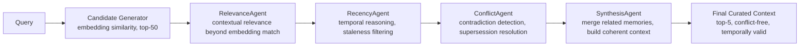

# agent-memory-system

**ASMR: Agentic & Reasoning-driven Memory — because retrieval should be a deliberation, not a lookup**

[](https://github.com/yourusername/agent-memory-system/actions)
[](https://www.python.org/downloads/)
[](https://opensource.org/licenses/MIT)

## Problem Statement

Every RAG system today does the same thing: embed → cosine similarity → top-k → stuff into context. It's passive and dumb. Here's what breaks:

1. **Stale documents rank high** — embeddings don't encode time. A 3-year-old product spec ranks the same as yesterday's update.

2. **Contradictions coexist** — "John Smith is CEO" and "Jane Doe is CEO" both get returned because embeddings can't detect conflict.

3. **No temporal reasoning** — "current policy" and "deprecated policy" are treated equally. The model has no concept of "as of when?"

4. **No supersession logic** — when information gets updated, the old version doesn't get deprioritized. Both versions compete equally.

5. **Superficial matching** — "Python performance optimization" matches "Monty Python's Flying Circus" because they share tokens. Embeddings don't understand context.

**ASMR fixes this** by replacing passive vector lookup with active multi-agent reasoning over memory. Retrieval becomes a deliberation.

## Architecture



## Why Not Just RAG?

| Aspect | Passive RAG | ASMR |
|--------|-------------|------|
| **Relevance Judging** | Cosine similarity only | LLM reasoning about actual relevance |
| **Temporal Awareness** | None | Recency scoring, staleness detection, temporal language parsing |
| **Conflict Handling** | None — contradictions coexist | Active detection, supersession chains, resolution reasoning |
| **Context Quality** | Whatever matches best | Curated, conflict-free, temporally valid |
| **Extensibility** | Fixed algorithm | Pluggable agent pipeline |

## Agent Roles

### RelevanceAgent

**Responsibility:** Determine if a memory is actually relevant to the query, beyond surface-level embedding similarity.

**Input:** Query + candidate memories from embedding search
**Output:** Per-memory decision (keep/discard) with confidence score and reasoning

**Strategy:** Few-shot prompting with examples of superficial vs. genuine matches. The agent asks: "Is this memory actually about what the user is asking, or does it just share some words?"

**Example:**
- Query: "Python performance optimization"
- Candidate: "Monty Python's Flying Circus was a British comedy show..."
- Decision: DISCARD (confidence: 0.95) — "This is about the comedy show, not the programming language"

### RecencyAgent

**Responsibility:** Apply temporal reasoning to filter stale information and prioritize current data.

**Input:** Memories with timestamps + temporal context from query
**Output:** Per-memory recency assessment + staleness flags

**Strategy:**
1. Compute recency scores using exponential decay
2. Detect temporal language in content ("as of 2023", "current CEO")
3. Cross-reference with newer memories on same topic

**Example:**
- Memory A (2022): "Our return policy is 30 days"
- Memory B (2024): "Updated: Return policy is now 15 days"
- Decision: Flag A as superseded, prioritize B

### ConflictAgent

**Responsibility:** Detect contradictions between memories and resolve them using supersession logic.

**Input:** Memories that passed relevance/recency filters
**Output:** Conflict records with winner/loser and reasoning

**Strategy:** Pairwise comparison of potentially conflicting memories. Determines conflict type:
- **Full contradiction:** Newer wins
- **Partial update:** Both valid for different scopes
- **Scope difference:** Specific overrides general

**Example:**
- Memory A: "Company-wide budget is $1M"
- Memory B: "Engineering budget is $400K"
- Decision: No conflict — B is a specific subset of A

### SynthesisAgent

**Responsibility:** Merge related memories into a coherent context, with proper attribution.

**Input:** Surviving memories after filtering
**Output:** Synthesized context string with source citations

**Strategy:** Group by topic/entity, summarize each group, maintain token budget by prioritizing high-confidence memories.

## Use Cases

### Research Assistant
Track evolving knowledge over time. Papers get published, findings get updated or contradicted. ASMR ensures you're working with the latest understanding, not outdated conclusions.

### Customer Support
Handle policy changes gracefully. When the return window changes from 30 to 15 days, customers get the current policy, not a confusing mix of old and new.

### Personal Assistant
Navigate preference evolution. When a user says "I love Italian food" then later "I'm trying to avoid carbs," ASMR understands the temporal relationship and weights preferences appropriately.

## Key Features

1. **Active Reasoning, Not Passive Lookup** — LLM agents deliberate on what belongs in context
2. **Temporal Awareness** — Recency scoring, staleness detection, decay functions
3. **Conflict Resolution** — Supersession chains, contradiction detection, resolution reasoning
4. **Drop-in Replacement** — LangChain and LlamaIndex retrievers included
5. **Extensible Architecture** — Add custom agents, modify the pipeline, tune thresholds
6. **Full Evaluation Suite** — Benchmarks against naive RAG, MMR, and time-weighted baselines

## Quick Start

```python
from agent_memory_system import RetrievalPipeline

# Initialize pipeline
pipeline = RetrievalPipeline()

# Add memories with temporal information
pipeline.add_memory("Return policy: 30 days full refund", source="policy_v1",
                    metadata={"effective_date": "2022-01-01"})
pipeline.add_memory("Updated: Return policy is now 15 days", source="policy_v2",
                    metadata={"effective_date": "2024-01-01"})
pipeline.add_memory("Our store sells electronics and appliances", source="about")

# Query with reasoning
result = pipeline.retrieve("What is the current return policy?")

# See agent decisions
for decision in result.agent_decisions:
    print(f"{decision.agent_name}: {decision.action} — {decision.reasoning}")

# Get curated context
print(result.final_context)
# Output: "Return policy (as of 2024): 15 days. [Source: policy_v2]"
```

## Installation

```bash
pip install agent-memory-system
```

Or install from source:

```bash
git clone https://github.com/yourusername/agent-memory-system.git
cd agent-memory-system
pip install -e ".[dev]"
```

## Configuration

ASMR is configured via YAML files in `configs/`:

- `memory_config.yaml` — Storage backend, embedding model, persistence
- `agents_config.yaml` — LLM provider, model, temperature, thresholds per agent
- `retrieval_config.yaml` — Pipeline settings, candidate count, token budgets

## Tech Stack

- **Python 3.10+**
- **LangChain / LlamaIndex** — Framework integrations
- **FAISS / ChromaDB** — Vector indexing (candidate generation only)
- **OpenAI / Anthropic** — LLM providers for agent reasoning
- **Sentence Transformers** — Embedding models
- **Pydantic v2** — Data validation and schemas

## Contributing

Contributions welcome! Please read our contributing guidelines and submit PRs.

## License

MIT License — see [LICENSE](LICENSE) for details.
